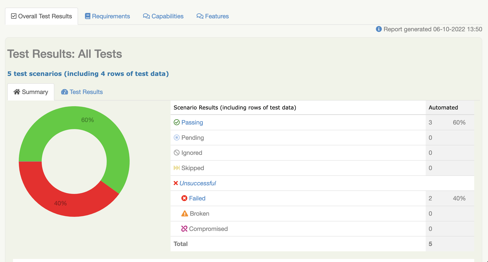

# Serenity_Cucumber_GitLab_CI test task

Instructions how to install, run and write new tests
- git copy "https link to the repository"
- enter into the terminal "mvn clean verify" (should have JAVA on your local PC)
- how to write a new test:
  - create a feature file with cucumber scenarios
  - create java class with automation code for the cucumber scenarios

What was refactored and why
- Changed cucumber scenario to Outline (for running tests with different parameters)
- Added 1 negative scenario
- Deleted gradle (because we use maven)
- Deleted CarsAPI.class (don't know what the cars should be in the test)
- Deleted .github folder (we won't use GitGub Actions)
- Rewrote SearchStepDefinitions.java file (for running tests with new scenarios)
- Added gitlab-ci file (for GitLab CI configuration)
- Put one serenity version for all dependencies in the pom.xml file (will be better to change a version)